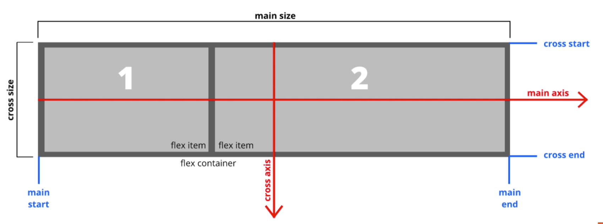

# What is flexbox?

- A modern layout mode in CSS3
- `flex` is a value for the `display` property
- Replaces floats and is much more elegant to work with
- Aligns items both horizontally and vertically
- Flex items can be re-ordered via CSS

# How it works

- Create a `container` and set its `display` attribute to `flex`
- All direct child elements are "flex items". All child elements will align horizontally automatically.

- Note that:
  - When the flex direction is row, the main axis is left to right horizontal and the cross axis is top to bot vertical
  - When the flex direction is column, the main axis is top to bot vertical and the cross axis is left to right horizontal 